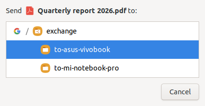

# nemo-send-to-drive

A Nemo context-menu action that copies the selected files and folders into a
per-device folder on Google Drive.

The idea is a drop box for moving things between machines: one `exchange`
folder at the root of Drive, one subfolder per device inside it. Right-click,
pick a device, done.



## Requirements

- Nemo (tested on 4.4.2, Ubuntu 20.04)
- A Google account added in **Online Accounts** with **Files** enabled
- `python3-gi`, `gir1.2-gtk-3.0`, `gir1.2-notify-0.7`, `gvfs-backends`

All of these ship with Linux Mint and with Ubuntu + Cinnamon. No pip packages,
no other runtime dependencies - the action declares only `python3`.

## Install

```sh
git clone git@github.com:Apache02/nemo-send-to-drive.git
cd nemo-send-to-drive
./install.sh
nemo -q          # only if Nemo is already running
```

`install.sh` symlinks the two files into `~/.local/share/nemo/actions/`, so
edits in the repo take effect on the next right-click. `./install.sh --undo`
removes the links.

Then create the folders on Google Drive:

```
My Drive/
└── exchange/
    ├── to-asus-vivobook/
    └── to-mi-notebook-pro/
```

The subfolder names are yours to choose; the chooser reads them live, so a new
folder shows up without touching any config.

## Usage

Select anything in Nemo, right-click, **Send to Google Drive/exchange…**

- Clicking a row starts the transfer immediately - there is no confirm button
- `exchange` itself is offered as a target alongside the device folders
- Existing files are overwritten silently; this is a drop box, not storage
- `Esc` closes the chooser, but is ignored once a transfer is running, so a
  stray keypress cannot abort an upload. Use Cancel for that.

There is also a headless path, handy for scripting:

```sh
actions/send-to-google-drive.py --device to-mi-notebook-pro file:///path/to/file
```

Every run appends to `~/.cache/send-to-google-drive.log`.

## How it works, and why it looks like this

Most of this file is shaped by things gvfs and Nemo do that are not obvious.

**Nemo's `< >` Exec syntax wraps the whole command.** `Exec=<script.py %U>`
works; `Exec=<script.py> %U` does not. The second form still draws the menu
entry, but clicking it does nothing at all - no error anywhere. Compare with
Nemo's own shipped `send-by-mail.nemo_action`.

**Paths on Google Drive are addressed by file id, not by name.** Listing the
mount gives entries like `1v2_kltzBgy7ZYB1fsG-2AmHrfvpRT-O8`; the human name
lives in the separate `standard::display-name` attribute. Name lookups do
resolve, but ids are what get stored and passed around here - they are
URL-safe, so no escaping is ever needed regardless of what a folder is called.

**Writes through the FUSE mount are not committed when the call returns.**
Copying a batch with `cp -r` into `/run/user/$UID/gvfs/...` leaves the last
file reading back as 0 bytes for several seconds:

| after copying 6 files | immediately | after 8s |
|---|---|---|
| `cp -r` over FUSE | last file **0 B** | 18 B |
| `Gio.File.copy()` | **all correct** | correct |

So everything goes through the native gvfs backend instead. This is the main
reason the action is Python rather than a shell script: `gio copy` refuses to
recurse into directories (`Can't recursively copy directory`), and doing the
recursion in shell means falling back to `cp -r` and the FUSE lag with it.
Recursing in Python keeps every single file on the native path.

**Google Drive allows two children with the same name in one folder.** Creating
a destination folder blindly would pile up duplicates on every send, so folders
are resolved by display name and reused.

**The tree indent uses a `Gtk.SizeGroup`, not padding.** Child rows have to
clear the `<drive> /` prefix that only the `exchange` row carries. Spaces would
tie the alignment to the font; the size group makes the offset exact. Measured
across four fonts, the step stays at exactly `INDENT_PX` while the absolute
position drifts by a pixel or two as the `/` glyph changes width.

## Tests

```sh
tests/run_all.sh
```

Needs an X session and a mounted Drive with an `exchange` folder. The copy test
creates a throwaway `__pytest__` folder inside it and deletes it afterwards.

| File | Covers |
|---|---|
| `test_copy_engine.py` | non-ASCII and shell-hostile names, three-level recursion, overwrite without duplicates, no truncation from the write lag, `exchange` as a target, argument errors |
| `test_escape.py` | Esc closes the chooser, Esc is dead during a transfer, Cancel still works |
| `test_alignment.py` | tree indent stays constant across fonts |
| `render_window.py` | dev tool: renders the chooser to a PNG |

Tests always load `actions/send-to-google-drive.py` from the repo, never
whatever is installed, and discover the Drive account rather than hardcoding
one.

## Troubleshooting

**The menu entry is missing.** `nemo -q`, then reopen. If it is still absent,
check the `Dependencies=` line in the `.nemo_action` - Nemo hides an action
whose dependencies it cannot find in `PATH`.

**The entry is there but nothing happens.** Almost always the `< >` Exec
problem described above. `NEMO_DEBUG=Actions nemo --debug` shows what Nemo
parsed.

**"Google Drive is not mounted".** Open the account once from the Nemo sidebar
so gvfs mounts it, then retry.

## License

MIT - see [LICENSE](LICENSE).
